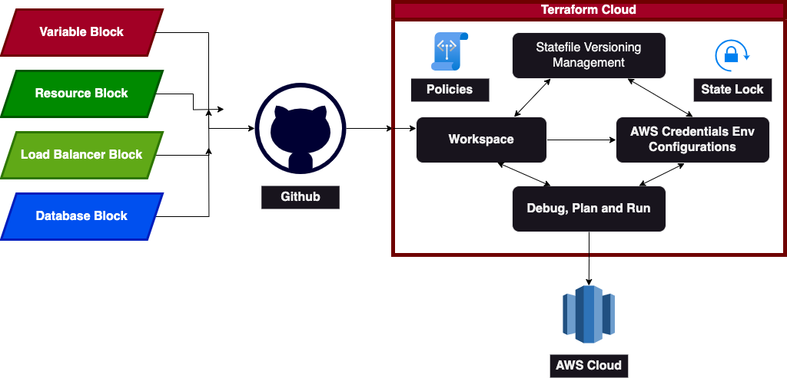

# Terraform Cloud Project
## Project Demo for Terraform Cloud




>[!Note]
>## Tools Used
>VSCode, Github, Terraform, Terraform Cloud

>[!Tip]
>## Execution Path
>Manifest File -> PUSH -> Github -> PUSH -> Terraform Cloud -> Organisation -> Run -> AWS Cloud

## Manifest File : Contains providers, resources and variables
Github -> SCM containts Terraform project and HCL Script 
Terraform Cloud -> Cloud IAAC management with version control. Creating Organisation
Organisation -> Different workspace for Dev, QA, Stagin, Production, Deliver and DR

## Basic
1. Install Terraform, Github on either remote server or local machine
2. Create a terraform manifest file to create 4 ec2-instance with ubuntu version
3. Make sure 2 public and 2 private servers, nat gateway, internet gateway , subnets and private table

## Github 
1. Create a new public repository with .gitignore as terraform
2. Copy all tf files and push to origin

## Terraform Cloud
1. Search Terraform Cloud and pick the official link
2. Create a free account -> Confirm email -> Create Organisation -> Create Workspace
3. Version Control Workflow - Git based workspace
4. CLI-Driver - CLI Based
5. API-Driver - Application based like VSCode
6. We are using Version Control -> Github -> Authorise -> Select the repo -> Confirm 
7. Get into the workspace -> Configure variables or left side pane Variables 
8. Add Variable -> Environment -> ```AWS_ACCESS_KEY_ID(key) -> account access key(value)```
9. Add Variable -> Environment -> ```AWS_SECRET_ACCESS_KEY(key) -> account secret access key(value)```
10. Start Plan -> Check for ```terraform plan``` results -> if okay -> Confirm & Apply -> to perform ```terraform apply —auto -approve```
11. After Successful Run -> TFSTATE file will be there in left pane -> States
12. We will generate state files for each run. So we can download older versions of state files
13. Top Right -> Lock -> to lock state files when concurrent access requests appear
14. Sentinel Policies (Paid)
15. it will deny the unauthorised users (who try to change public/private sources, stealing info, deleting stuffs)
16. Key Management Services
17. This will start securing resources during creation itself (ignore_changes life-cycle only secure resources after creation)
18. Make a small change in resource -> push to origin git -> wait for terraform cloud to catch the change and start execution
19. Left Side Pane -> Settings -> Destruction & Deletion 
20. Destruction - Delete all the resources created by the terraform in the workspace
21. Delete - Delete all the resources, variables, settings in the workspace and delete workspace too

